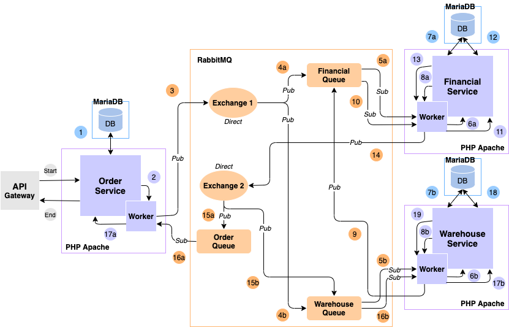

# TDD Microservice in PHP
## Introduction
This project is a proof-of-concept of Microservice Architecture build using CodeIgniter 3 with Test Driven Development in mind.  

There are three main decoupled service in this projects: Financial service, Order service, and Warehouse service. Each services has its own MySQL database, in case a service need data from another service, the service will do the checking using Helper that pass message through RabbitMQ AMQP Queue. All these dependency are already packed in one docker-compose.

## Prerequiste
- Docker
- Docker Compose
- Composer
- Apache HTTP Server (Optional, already bundled in docker-compose)
- PHP 7.3 (Optional, already bundled in docker-compose)
- MySQL 8.0 (Optional, already bundled in docker-compose)
- RabbitMQ (Optional, alraedy bundled in docker-compose)

## Running
Normally, to run PHP application we just need to access it from browser by entering the address and the browser will render the page according to the instructions coded. To enable the worker subscribtion to the queue, it need to run continously, thus the worker run by using CLI. Worker initialization is done automatically if using docker-compose, if not then start the worker by running the start_worker.sh script on each service directory. 

**Install dependency using script (recommended)**
```
chmod +x ./install-dependency.sh
./install-dependency.sh
```

**Install dependency manually (If you are unable to run the script)**
```
cd financial
composer install
cd ..
cd order
composer install
cd ..
cd warehouse
composer install
cd ..
```

**Start with docker (recommended)**
```
docker-compose up
```

php container will fail several time, it is normal, because it is waiting for the RabbitMQ container to be up.

If containers are run succesfully, you will see two lines of messages like shown bellow, that means the worker already started subscribing to the queue.
```
[x] Awaiting message
``` 

## Database Migration
To start database migration,access each service with migrate route (by default the services run in port 8081, 8082, and 8083)
```http
localhost:8081/tdd-microservice-poc/index.php/migrate
localhost:8082/tdd-microservice-poc/index.php/migrate
localhost:8083/tdd-microservice-poc/index.php/migrate
```

## API
### Financial Service
#### Get list of invoices
```http
GET localhost:8081/tdd-microservice-poc/index.php/api/v1/invoices
```

#### Create a new invoice
(Usually called by helper after order check out)
```http
POST localhost:8081/tdd-microservice-poc/index.php/api/v1/invoices
```

Request Body
```json
{
    "id": "1",
    "order_id": "1",
    "total": "10000",
    "status": "incomplete"
}
```
`id` is optional, it is auto-increased from previous data in the table
#### Get an invoice

```http
GET localhost:8081/tdd-microservice-poc/index.php/api/v1/invoices/{invoice_id}
```

#### Update an invoice 
```http
PUT localhost:8081/tdd-microservice-poc/index.php/api/v1/invoices/{invoice_id}
```

Request Body
```json
{
    "status": "waiting"
}
```

#### Delete an invoice
```http
DELETE localhost:8081/tdd-microservice-poc/index.php/api/v1/invoices/{invoice_id}
```

#### Update an invoice by order id
(Usually called by helper after confirming stock exist)
```http
PUT localhost:8081/tdd-microservice-poc/index.php/api/v1/invoices/orders/{order_id}
```

Request Body
```json
{
    "status": "waiting"
}
```

#### Delete an invoice by order id
(Usually called by helper after failing to confirm stock exist)
```http
DELETE localhost:8081/tdd-microservice-poc/index.php/api/v1/invoices/{invoice_id}
```

### Order Service
#### Get list of orders
```http
GET localhost:8082/tdd-microservice-poc/index.php/api/v1/orders
```

#### Create a new order
```http
POST localhost:8082/tdd-microservice-poc/index.php/api/v1/orders
```
Request Body
```json
{
    "id": "1",
    "product_id": "1",
    "quantity": "5",
    "price": "5000"
}
```
`id` is optional, it is auto-increased from previous data in the table

#### Get an order
```http
GET localhost:8082/tdd-microservice-poc/index.php/api/v1/orders/{order_id}
```

#### Update an order
```http
PUT localhost:8082/tdd-microservice-poc/index.php/api/v1/orders/{order_id}
```

Request Body
```json
{
    "quantity": "10",
    "price": "500"
}
```

#### Delete an order
```http
DELETE localhost:8082/tdd-microservice-poc/index.php/api/v1/orders/{order_id}
```

Request Body
```json
(Not required)
```

#### Checkout an order to create it invoice and update the stock
(Will create invoice and check if products is in stock)
```http
POST localhost:8082/tdd-microservice-poc/index.php/api/v1/orders/checkout/{order_id}
```

### Warehouse Service
#### Get list of products
```http
GET localhost:8083/tdd-microservice-poc/index.php/api/v1/products
```

#### Create a new product
```http
POST localhost:8083/tdd-microservice-poc/index.php/api/v1/products
```

Request Body
```json
{
    "id": "1",
    "stock": "10",
    "price": "500"
}
```
`id` is optional, it is auto-increased from previous data in the table

#### Get a product
```http
GET localhost:8083/tdd-microservice-poc/index.php/api/v1/products/{product_id}
```

#### Update a product
```http
PUT localhost:8083/tdd-microservice-poc/index.php/api/v1/products/{product_id}
```

Request Body
```json
{
    "stock": "10",
    "price": "500"
}
```

#### Delete a product
```http
DELETE localhost:8083/tdd-microservice-poc/index.php/api/v1/products/{product_id}
```

#### Update stock of a product
```http
PUT localhost:8083/tdd-microservice-poc/index.php/api/v1/products/stocks/{product_id}
```

Request Body (Decrese stock by 10)
```json
{
    "quantity" : "-10"
}
```

Request Body (Increase stock by 10)
```json
{
    "quantity" : "+10"
}
```

## Architecture
Here is the architecture for the microservice (if it fails to show, you can open the `TDD Microservice.xml` in draw.io)



- API Gateway on the diagram is not included in this repository, but it's not necessary for this repository to work

- Each outlined rectangle is a separate Docker Container.

- Service is written in PHP, but it can be changed as RabbitMQ is Language-Agnostic.

- RabbitMQ can only receive and send a message in String format, it is possible to receive and send JSON string.

- Traditionally, PHP application runs in a Web Server, it can't be used to receive the message through a socket, thus a PHP Service needs one or more Worker(s) to receive message. The worker is optionally used in sending a message as sending can be simply done using a conventional method/function.

- Exchange is used when a message is needed to be sent to more than one Queue.

- Exchange can route a message conditionally, but in this scenario, it only use Direct Routing, thus it will send all the message to all the Queue bonded to it.

- Processes with (a) and (b) is processed separately without waiting for the other Service (asynchronously).

- RabbitMQ can be used as gRPC, but the process will be synchronous, it is not fit to be used in this scenario.

## How It Works
**Start** - A User wants to check-out their selected order, User hit the UI and Request (orderId 1) sent by API Gateway to Order Service.

**1** - Order Service fetches the Order Detail of (orderId 1), Order Service get (productId 1, quantity 10) detail.

**2** - Order Service pass (orderId 1, productId 1, quantity 10) to Order Worker to create invoice and to check if the product is in stock.

**3** - Order Worker sends a message (orderId 1, productId 1, quantity 10) to Exchange 1.

**4a,4b** - Exchange 1 received message (orderId 1, productId 1, quantity 10), as it is a Direct Exchange, it forwards the message to Subscribing Queue(s).  

**5a** - Financial Worker received a message (orderId 1, productId 1, quantity 10), then Financial Worker passes the message to Financial Service to be processed.

**5b** - Warehouse Worker received a message (orderId 1, productId 1, quantity 10), then Warehouse Worker pass only (productId 1, quantity 10) to Warehouse Service to be checked.

**6a** - Financial Service creates an Invoice based on the message (orderId 1, productId 1, quantity 10).

**6b** - Warehouse Service prepares a query to check stock based on the productId 1.

**7a** - Financial Service successfully created the Invoice on Financial Database.

**7b** - Warehouse Service fetches stock from Warehouse Database.

**8a** - Financial Service tells Financial Worker that it has created the Invoice.

**8b** - Warehouse Service gets information (stock 50) and compares it to quantity 10, because (stock > quantity), the order can be processed, send (productId 1, quantity 10, inStock true) to Warehouse Worker.

**9** - Warehouse Worker sends a message (productId 1, quantity 10, inStock true) to Financial Queue.

**10** - Financial Worker receives a message (productId 1, quantity 10, inStock true) stored in Financial Queue.

**11** - Financial Worker then passes the message to Financial Service to be processed.

**12** - Financial Service updates the Invoice status.

**13** - Financial Service tells Financial Worker that it has updated the Invoice.

**14** - Financial Worker sends a message (productId 1, quantity 10, invoice true) to Exchange 2.

**15a, 15b** - Exchange 2 received a message (productId 1, quantity 10, invoice true), as it is a Direct Exchange, it forwards the message to Subscribing Queue(s).  

**16a** - Order Worker received a message (productId 1, quantity 10, invoice true), then Order Worker passes the message to Order Service to be processed.

**16b** - Warehouse Worker received a message (productId 1, quantity 10, invoice true), then Warehouse Worker passes the message to Warehouse Service to be processed.

**17a** - Order Worker completes the user's check-out process.

**17b** - Warehouse Service prepares a query to decrease the product's stock based on the message (productId 1, quantity 10, invoice true).

**18** - Warehouse Service decreases the stock of the product in the Warehouse Database.

**19** - Warehouse Service tells Warehouse Worker that it has updated the Stock.

**End** - Order Worker returns the detail of the check-out process.